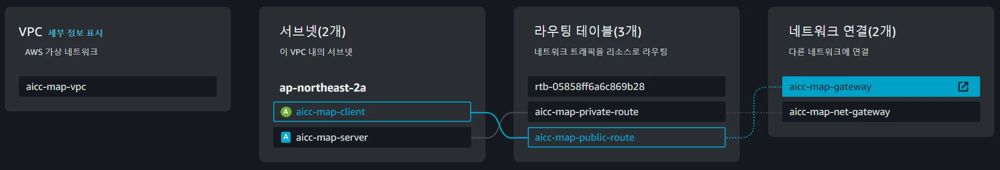

# Client 배포를 위한 Repository 입니다. 

- react로 구성하였습니다. 
- PORT 3000으로 구성하였으며, Server 인스턴스와 통신합니다. 

# client 관련 구조도

# AWS VPC Public Subnet
- aicc-map-client로 생성했으며, 10.0.0.0/22로 구성했습니다. 
- 사용 가능한 IP를 1019개 할당해주었습니다.
- 서비스 사용자가 접근하기 쉬워야 한다고 생각했기에, 인터넷과 직접 연결될 수 있는 서브넷으로 구성했습니다. 
- 해당 Client 인스턴스는 Public으로 생성하며, Public IPv4 주소를 할당받도록 했습니다. 

# Routing Table
- VPC 내에서 네트워크 트래픽이 목적지로 어떻게 전달되는지 결정하는 구성요소로, 다음과 같이 구성했습니다. 
- 인터넷과 직접 통신할 수 있도록 설정했습니다.

''' 

Destination       Target
0.0.0.0/0         igw-07b79689a790e95d3   (인터넷 게이트웨이)
10.0.0.0/16       local                   (VPC 내부 트래픽)

'''

# Client 생성 인스턴스 정보 

| 인스턴스 | 인스턴스 유형 | Public IPv4 | Private IPv4 | 플랫폼 | 키 이름 |
|---------|--------------|-------------|--------------|--------|--------|
|map-client|t2.medium|3.38.104.114|10.0.1.58|Linux/UNIX|map-client|